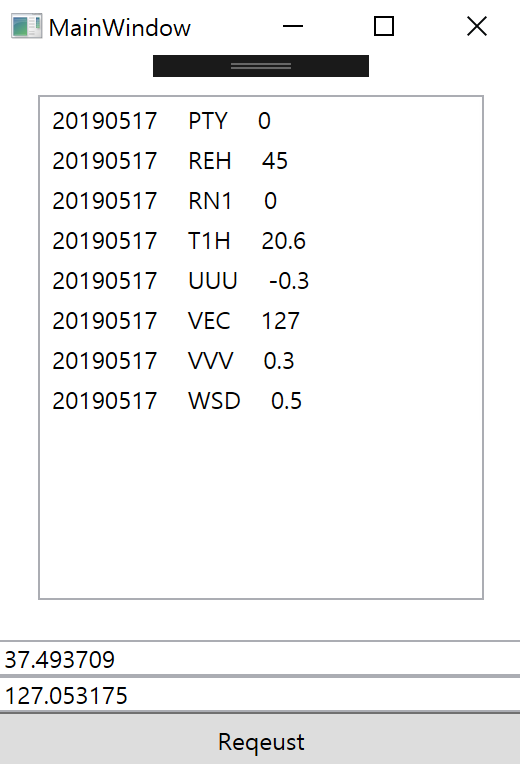
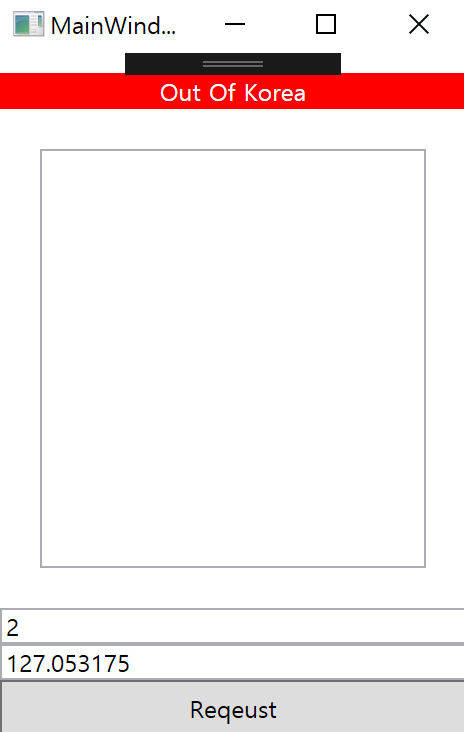

# KoreaWeatherAPIService
기상청에서 제공하는 '우리동네' 날씨 API 입니다.
'지금 날씨' 요청만 가능합니다.
해당 Open API는 위도,경도로의 요청을 받지 않아 위도,경도로 요청이 가능한 사용을 위해 작성하였습니다.
'우리 동네'를 사용하시는분께서 참고 하시기 바랍니다.

## 샘플 스크린샷
{: width="50%" height="50%"}
{: width="50%" height="50%"}

## 사용시
 - 샘플 실행 시 MainViewModel 에 API Key를 넣어주세요.
 
## 특징
 - 기상청에서 규정한대로 한국 지역만 요청이 가능합니다. 한국이 아닌 지역에 대하여 KoreaWeatherAPIException을 발생시킵니다.
